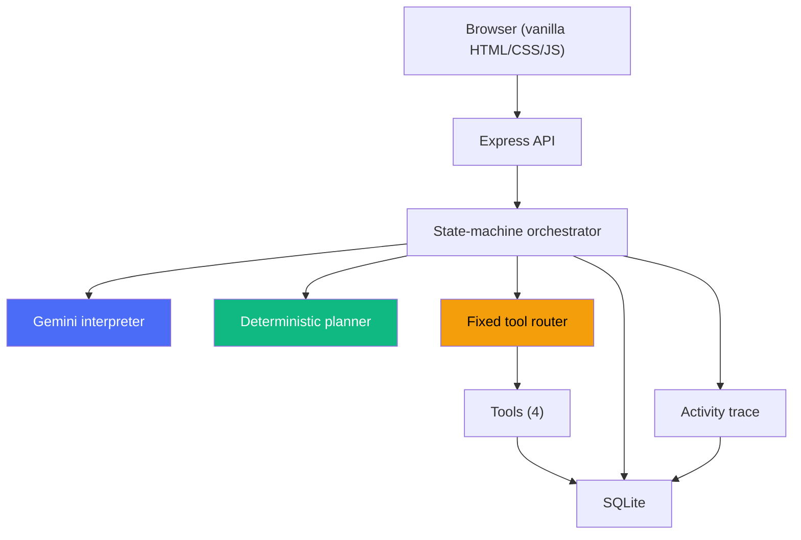
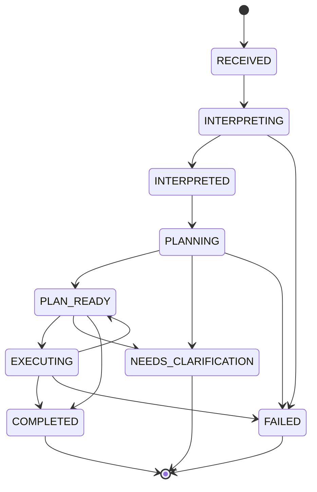

# Agentic Work Intake & Execution Prototype

An AI-powered system that takes unstructured work requests — emails, meeting notes, founder instructions, customer requests, bug reports — and turns them into structured, reviewable, partially automated workflows.

## Architecture



**Core principle: Gemini understands and writes. Code decides, routes, persists, validates, and gates execution.**

The LLM sits behind a provider-neutral interface. It is never trusted to directly decide what tools execute — the deterministic planner is authoritative.

## Agent Workflow



### Action State Machine

```
PENDING ──────→ EXECUTING ──→ COMPLETED
   │                          │
   ├──→ PENDING_APPROVAL      ├──→ FAILED
   │      │
   │      ├──→ APPROVED ──→ EXECUTING
   │      ├──→ REJECTED (terminal)
   │      └──→ PENDING_APPROVAL (edit, self-transition)
   │
   ├──→ BLOCKED (terminal)
   └──→ NEEDS_CLARIFICATION (terminal)
```

**Security invariant:** `PENDING_APPROVAL → EXECUTING` is illegal. Approval cannot be skipped. This is enforced by the transition table and tested explicitly.

## Demo

Watch the working prototype in action:

<video src="https://github.com/sai111-design/agentic-work-intake/raw/main/docs/demo.mp4" controls="controls" style="max-width: 100%;">
  <a href="https://github.com/sai111-design/agentic-work-intake/raw/main/docs/demo.mp4">View Demo Video</a>
</video>

## Setup

### Prerequisites

- Node.js ≥ 22.5 (uses built-in `node:sqlite`)
- A Google Gemini API key

### Install

```bash
git clone <repository-url>
cd agentic-work-intake
npm install
```

### Configure

```bash
cp .env.example .env
```

Edit `.env` and set your Gemini API key:

```env
GEMINI_API_KEY=your_gemini_api_key_here
GEMINI_MODEL=gemini-3.5-flash
DB_PATH=./data/app.db
PORT=3000
```

#### Getting a Gemini API Key

1. Go to [Google AI Studio](https://aistudio.google.com/apikey)
2. Sign in with your Google account
3. Click "Create API key"
4. Copy the key into your `.env` file

### Run

```bash
npm run dev
```

Open `http://localhost:3000` in your browser.

### Test

```bash
# Full offline test suite (no API key needed)
npm test

# Live Gemini smoke test (requires GEMINI_API_KEY)
npm run test:live
```

## Environment Variables

| Variable | Required | Default | Description |
|----------|----------|---------|-------------|
| `GEMINI_API_KEY` | Yes | — | Google Gemini API key |
| `GEMINI_MODEL` | No | `gemini-3.5-flash` | Gemini model identifier |
| `DB_PATH` | No | `./data/app.db` | SQLite database path |
| `PORT` | No | `3000` | HTTP server port |

## Three Scenarios

### Scenario 1: Partner Follow-up

**Input:** "Summarize a partner discussion, extract follow-ups, draft a thank-you email, and set a 7-day reminder."

**Demonstrates:**
- AI interpretation splits this into multiple actions
- Thank-you email draft → `PENDING_APPROVAL` (human must review)
- 7-day reminder → `EXECUTE_AUTOMATICALLY` (persisted in SQLite with computed due date)
- Generated brief summarises all results
- Approval workflow (approve/reject/edit)
- Complete activity trace

### Scenario 2: Website Review

**Input:** "Review https://hedamo.com"

**Demonstrates:**
- Website check tool performs bounded HTTP checks with SSRF protection
- Returns only evidence actually collected (HTTP status, page title, meta tags, response time)
- Generated technical report from real evidence
- Never fabricates accessibility/security/performance claims

### Scenario 3: Vague Request (Missing Information)

**Input:** "Please take care of the documentation and send it to everyone before the meeting."

**Demonstrates:**
- The system identifies missing information: which documentation? who is "everyone"? which meeting?
- Deterministic planner forces `REQUIRES_CLARIFICATION` — no tool execution
- The system never invents information to fill gaps
- UI clearly displays what's missing

## Design Decisions

### 1. Deterministic Planner Over LLM-Driven Routing

The LLM describes what the work IS (via structured output). The planner — pure TypeScript, no randomness — decides what the system DOES. This means the critical business rule ("missing info → no execution") is a guarantee, not a hope.

### 2. Provider-Neutral LLM Interface

`LLMProvider` is an interface; `GeminiProvider` is one implementation. The entire test suite runs against `FakeProvider` with no API key. This survived a provider migration without changing application code.

### 3. Schema-Constrained Structured Output

Gemini receives the JSON Schema and must return conforming JSON. The response is parsed and validated against Zod. Invalid output gets one retry with corrective feedback, then fails loudly. No partial or best-effort results.

### 4. Fixed Tool Registry

The router has exactly four tools. The LLM cannot name a tool into existence — tool names are validated against a fixed set before execution.

### 5. Human Approval Gate

Communication drafts always require approval. The state machine enforces this: there is no code path from `PENDING_APPROVAL` to `EXECUTING`. Approval is a genuine state transition, not a UI hint.

### 6. SSRF Protection

The website-check tool validates URLs against loopback, private IPs, link-local ranges, IPv6 internal addresses, and redirects. Each redirect destination is re-validated. This is tested with 27 cases.

## Security Considerations

- **No secrets in source:** Only `.env.example` is committed; `.env` is in `.gitignore`
- **No API key exposure:** Health endpoint reports provider/model but never the key
- **SSRF protection:** Blocks localhost, private IPs, link-local, IPv6 internal, redirect-to-internal
- **No arbitrary tool execution:** Fixed tool registry; LLM cannot invent tool names
- **No email sending:** Draft tool only generates subject + body; `sent: false` always
- **No arbitrary commands:** No `eval`, no command execution, no filesystem writes
- **SQL injection:** All queries use prepared statements with bound parameters
- **XSS:** All model-derived strings are HTML-escaped in the frontend
- **Activity trace safety:** API keys and secrets are never stored in events

## Failure Handling

The system demonstrates real failure paths:

| Failure | Behavior |
|---------|----------|
| Missing `GEMINI_API_KEY` | App starts, shows health banner, requests fail with `FAILED` status |
| LLM unavailable / timeout | `FAILED` status, error recorded in trace, no fabricated result |
| Malformed model output | One retry with feedback, then `VALIDATION_FAILED` |
| Schema validation failure | Rejected, never coerced |
| Tool failure | Action → `FAILED`, recorded in trace |
| Website unavailable | Reported honestly as unavailable |
| Rejected approval | Action → `REJECTED` (terminal) |
| Missing information | `REQUIRES_CLARIFICATION`, no tool execution |

## Limitations

1. **No real email sending** — drafts are generated but never sent. This is intentional (safety boundary).
2. **No real calendar integration** — reminders are persisted in SQLite, not synced to Google Calendar.
3. **Single-user** — no authentication or multi-tenancy.
4. **Polling, not push** — the UI polls every second rather than using WebSockets. Acceptable for a prototype.
5. **No undo** — terminal states (COMPLETED, FAILED, REJECTED) cannot be reverted.

## Future Improvements (5)

1. **WebSocket push** — replace polling with real-time updates for a snappier UX
2. **Clarification loop** — let the user supply missing information and re-run the blocked actions
3. **Multi-provider support** — add Anthropic/OpenAI behind the same `LLMProvider` interface
4. **Email integration** — connect to SMTP/Gmail API so approved drafts can actually be sent (with a confirmation gate)
5. **Persistent job queue** — use a proper job queue for long-running tools so the server can restart without losing in-flight work

## How AI Coding Tools Were Used

This project was built with assistance from Claude (Anthropic's AI coding assistant).

### What it helped with

- **Architecture design:** Helped structure the state machine, planner rules, and provider abstraction
- **Implementation:** Generated initial implementations of modules, then iterated through review
- **Test writing:** Produced comprehensive test suites for schema validation, SSRF, tools, and integration
- **Debugging:** Helped diagnose SDK compatibility issues (Gemini API shape differences between docs and reality)

### What was manually reviewed/tested

- Every module was reviewed for correctness after generation
- All tests were run and failures were investigated
- The Gemini adapter was verified against the actual installed SDK (`@google/genai` 2.16.0) — the SDK docs disagreed with the actual API shape (see `docs/sdk-spike.md`)
- Security boundary (SSRF) was tested with real URLs
- All three scenarios were tested end-to-end in the browser

### A real AI-generated mistake

During Phase 3, the SSRF module's IPv6 handling failed to account for Node's URL parser normalizing `::ffff:127.0.0.1` (dotted-decimal) to `::ffff:7f00:1` (hex form). The AI-generated code only matched the dotted-decimal pattern, so IPv4-mapped IPv6 loopback addresses passed through the SSRF check.

**How it was detected:** The SSRF test suite included a test case for `http://[::ffff:127.0.0.1]` which failed (1 of 94 tests).

**How it was fixed:** Added a second regex pattern to decode the hex-normalized form (`::ffff:XXYY:ZZWW`) back to dotted-decimal for private IP checking. The fix was a 7-line addition to `ssrf.ts`, verified by the same test case that caught the bug.

This is a genuine example of why testing matters: the AI-generated code looked correct and handled the obvious cases, but missed a platform-specific normalization behavior that only surfaced at runtime.

## Project Structure

```
src/
├── config.ts              # Environment → typed config
├── server.ts              # Entry point
├── api.ts                 # Express routes
├── orchestrator.ts        # State machine driver
├── core/
│   ├── schemas.ts         # Zod schemas (interpretation, action)
│   ├── types.ts           # Shared vocabulary (statuses, classifications)
│   ├── transitions.ts     # State machine transition tables
│   └── planner.ts         # Deterministic planner (pure function)
├── llm/
│   ├── provider.ts        # Provider-neutral interface
│   ├── gemini.ts          # Gemini adapter (only SDK import)
│   ├── prompt.ts          # System prompts
│   ├── structured.ts      # Parse-and-validate loop
│   └── schema-to-json.ts  # Zod → Gemini-safe JSON Schema
├── db/
│   ├── index.ts           # SQLite via node:sqlite
│   └── init.ts            # DB initialization script
├── tools/
│   ├── registry.ts        # Fixed tool registry
│   ├── ssrf.ts            # SSRF protection
│   ├── draft-communication.ts
│   ├── create-task.ts
│   ├── website-check.ts
│   ├── generate-brief.ts
│   └── init.ts            # Wire tools at startup
├── tests/
│   ├── fakes/provider.ts  # FakeProvider for offline tests
│   ├── fixtures.ts        # Shared test helpers
│   ├── schema.test.ts
│   ├── planner.test.ts
│   ├── state.test.ts
│   ├── structured.test.ts
│   ├── ssrf.test.ts
│   ├── tools.test.ts
│   └── integration.test.ts
└── tests-live/
    └── gemini.live.test.ts
public/
├── index.html
├── style.css
└── app.js
```
